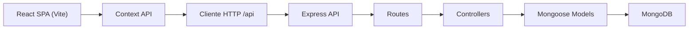
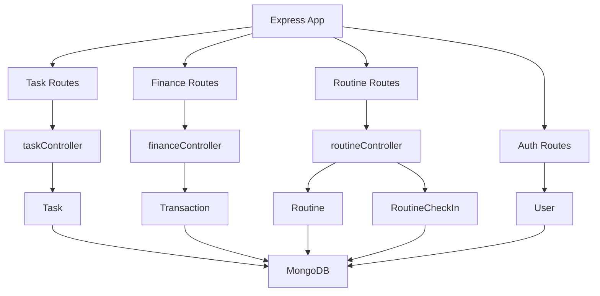
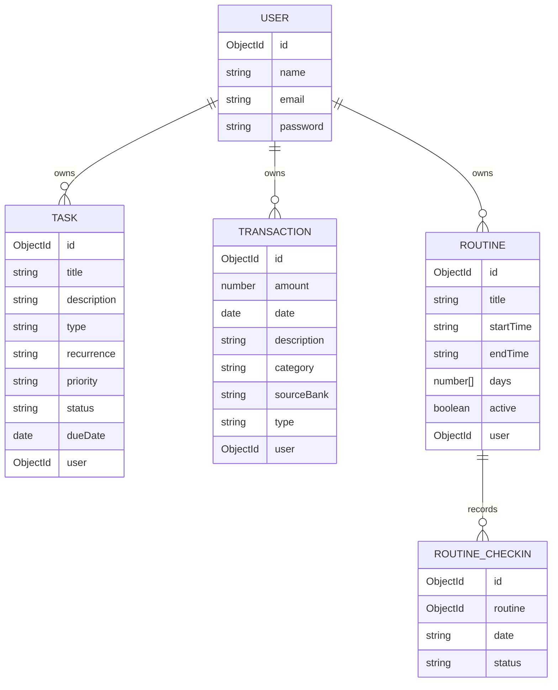

# 1. Diseño de Arquitectura

`OrganizAPP` utiliza una arquitectura full-stack desacoplada dentro de un mismo repositorio:
- frontend SPA en React + Vite
- backend API REST en Express + TypeScript
- persistencia en MongoDB con Mongoose
- estado global en frontend mediante Context API

La organización del backend sigue un enfoque limpio y modular con separación entre `routes`, `controllers`, `models`, `middleware` y `config`.



## 2. Stack tecnológico
- Frontend: React 18 + TypeScript + Vite
- UI: Tailwind CSS + Lucide React + Recharts
- Routing: React Router
- Estado global: Context API
- Backend: Node.js + Express + TypeScript ESM
- Base de datos: MongoDB + Mongoose
- Modo local sin dependencia estricta de Mongo: `mongodb-memory-server` como fallback de desarrollo
- Despliegue actual preparado para Vercel, con desarrollo local vía `nodemon` + `tsx`

## 3. Estructura principal del repositorio

```text
myorganizapp/
├─ api/
│  ├─ config/
│  ├─ controllers/
│  ├─ middleware/
│  ├─ models/
│  ├─ routes/
│  ├─ app.ts
│  ├─ index.ts
│  └─ server.ts
├─ src/
│  ├─ components/
│  ├─ context/
│  ├─ hooks/
│  ├─ lib/
│  ├─ pages/
│  ├─ App.tsx
│  └─ main.tsx
├─ public/
├─ vercel.json
└─ package.json
```

## 4. Módulos funcionales actuales

### 4.1 Dashboard
- Resume:
  - tasa de finalización de tareas
  - balance mensual
  - discipline score actual
- Consume datos de tareas, finanzas y rutinas desde Context API

### 4.2 Task Management
- Soporta tareas:
  - `one-time`
  - `recurring`
- Recurrencias implementadas:
  - `daily`
  - `weekly`
  - `monthly`
  - `yearly`
- Estados:
  - `pending`
  - `completed`
- Prioridades:
  - `low`
  - `medium`
  - `high`
- Regla de negocio actual:
  - cuando una tarea recurrente se marca como completada, se genera automáticamente la siguiente ocurrencia

### 4.3 Finance Manager
- Alta manual de transacciones
- Importador mock de extractos:
  - BBVA
  - Banco Nación
  - MercadoPago
- Tipos de movimiento:
  - `income`
  - `expense`

### 4.4 Weekly Routine & Discipline Tracker
- Definición de rutinas con:
  - título
  - hora de inicio
  - hora de fin
  - días activos
- Check-ins diarios por rutina:
  - `completed`
  - `missed`
- Métrica disponible:
  - discipline score agregado a partir de rutinas activas y check-ins realizados

## 5. Rutas principales

### 5.1 Frontend
| Ruta | Vista | Propósito |
|------|-------|-----------|
| `/` | Dashboard | Resumen general de productividad, finanzas y disciplina |
| `/tasks` | Tasks | Gestión de tareas y recurrencias |
| `/finance` | Finance | Alta e importación de movimientos |
| `/routines` | Routines | Rutinas fijas, check-ins y seguimiento |

### 5.2 Backend API
| Ruta | Método | Propósito |
|------|--------|-----------|
| `/api/health` | GET | Healthcheck |
| `/api/tasks` | GET | Listar tareas |
| `/api/tasks` | POST | Crear tarea |
| `/api/tasks/:id` | PUT | Actualizar tarea |
| `/api/tasks/:id` | DELETE | Eliminar tarea |
| `/api/finance` | GET | Listar transacciones |
| `/api/finance` | POST | Crear transacción manual |
| `/api/finance/:id` | DELETE | Eliminar transacción |
| `/api/finance/upload` | POST | Parsear e importar extracto mock |
| `/api/routines` | GET | Listar rutinas |
| `/api/routines` | POST | Crear rutina |
| `/api/routines/:id` | DELETE | Eliminar rutina |
| `/api/routines/checkin` | POST | Registrar check-in |
| `/api/routines/checkins` | GET | Listar check-ins |
| `/api/routines/score` | GET | Obtener discipline score |
| `/api/auth/register` | POST | Placeholder |
| `/api/auth/login` | POST | Placeholder |
| `/api/auth/logout` | POST | Placeholder |

## 6. Diagrama interno del servidor



## 7. Modelo de datos

### 7.1 Entidades principales



## 8. Reglas de negocio actuales

### 8.1 Tareas recurrentes
- Si una tarea recurrente cambia a `completed`, el backend calcula la próxima fecha y crea una nueva tarea derivada.
- La nueva tarea conserva la configuración principal de la original.

### 8.2 Importación financiera
- BBVA: parseo mock basado en CSV con separador por comas.
- Banco Nación: parseo mock basado en CSV con separador por punto y coma.
- MercadoPago: parseo mock de estructura JSON.
- La importación convierte los datos externos al modelo unificado `Transaction`.

### 8.3 Discipline Score
- Se calcula usando la cantidad de rutinas activas y los check-ins completados para una fecha o período.
- El objetivo del módulo es medir consistencia, no solo existencia de rutinas planificadas.

## 9. Ejecución local
- Instalar dependencias: `npm install`
- Ejecutar frontend + backend: `npm run dev`
- Frontend local: Vite
- Backend local: Express en puerto `3001`
- Mongo preferido: `mongodb://127.0.0.1:27017/organizapp`
- Si Mongo no está disponible en desarrollo, el backend puede levantar con base en memoria

## 10. Consideraciones técnicas
- El cliente actualmente consume la API vía `http://localhost:3001/api`
- Existe proxy de Vite para `/api`, pero el cliente no lo aprovecha todavía de forma completa
- La autenticación real aún no está cerrada; el proyecto usa `mockAuth` para operar en solo mode
- La documentación debe seguir la implementación real y actualizarse cuando cambien modelos, rutas o flujos
