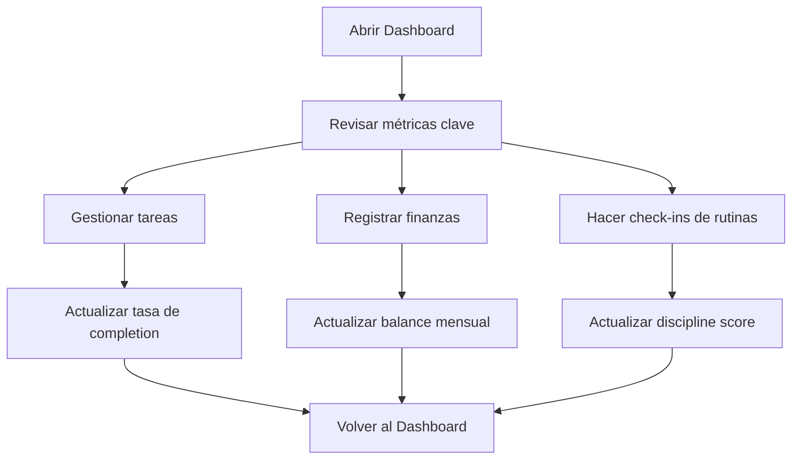

# 1. Visión General del Producto

`OrganizAPP` es una aplicación de organización personal enfocada en productividad, finanzas y disciplina diaria.

- Propósito: centralizar en una sola interfaz la gestión de tareas, movimientos financieros y rutinas semanales.
- Usuario objetivo: una persona que administra su vida personal en solo mode, sin necesidad de múltiples roles ni un sistema de autenticación complejo en la primera etapa.
- Valor principal: reducir fricción operativa y mostrar métricas accionables desde un dashboard único.

## 2. Objetivos del producto
- Registrar y completar tareas con soporte de recurrencias.
- Cargar movimientos financieros manualmente o por importación mock de extractos.
- Definir rutinas y marcar check-ins diarios.
- Visualizar indicadores rápidos:
  - progreso de tareas
  - balance mensual
  - discipline score

## 3. Alcance funcional actual

### 3.1 Roles de usuario
| Rol | Método de acceso | Permisos principales |
|-----|------------------|----------------------|
| Usuario único | Solo mode con `mockAuth` | CRUD de tareas, finanzas y rutinas; acceso al dashboard |

### 3.2 Módulos funcionales
1. **Dashboard**: vista principal con resumen de productividad, finanzas y disciplina.
2. **Tasks**: gestión de tareas one-time y recurring, con prioridad, estado y fecha objetivo.
3. **Finance**: alta manual de transacciones e importación mock desde BBVA, Banco Nación y MercadoPago.
4. **Routines**: definición de rutinas con bloques horarios y check-ins por día.
5. **Infraestructura local**: soporte para Mongo real o base en memoria en desarrollo.

## 4. Detalle funcional por módulo

### 4.1 Dashboard
- Mostrar `Task Completion Rate`.
- Mostrar `Monthly Balance`.
- Mostrar `Discipline Score`.
- Usar tarjetas simples y visualización breve con charts/progress bars.

### 4.2 Tasks
- Crear tarea con:
  - título
  - tipo
  - recurrencia
  - prioridad
  - estado
  - fecha de vencimiento opcional
- Listar tareas existentes.
- Cambiar estado `pending/completed`.
- Eliminar tareas.
- Generar automáticamente la siguiente tarea cuando una recurrente se completa.

### 4.3 Finance
- Cargar transacción manual con:
  - monto
  - tipo
  - categoría
  - fuente
  - fecha
- Importar extractos mock:
  - BBVA por CSV
  - Banco Nación por CSV
  - MercadoPago por JSON
- Listar movimientos y distinguir visualmente ingresos y gastos.

### 4.4 Routines
- Crear rutina con:
  - título
  - hora de inicio
  - hora de fin
  - días activos
- Registrar check-in diario como:
  - `completed`
  - `missed`
- Mostrar el discipline score como indicador resumido.

## 5. Flujos principales

### 5.1 Flujo de productividad
1. El usuario entra al dashboard.
2. Revisa tareas pendientes y métricas del día.
3. Va a `Tasks`.
4. Crea o completa tareas.
5. Vuelve al dashboard para ver el impacto en el completion rate.

### 5.2 Flujo financiero
1. El usuario entra a `Finance`.
2. Agrega una transacción manual o pega un extracto.
3. El sistema normaliza los datos y los guarda.
4. El balance mensual se refleja en el dashboard.

### 5.3 Flujo de disciplina
1. El usuario define rutinas semanales.
2. Cada día registra check-ins.
3. El sistema calcula el score de disciplina.
4. El dashboard resume el porcentaje alcanzado.

## 6. Páginas del producto
| Página | Ruta | Descripción funcional |
|-------|------|------------------------|
| Dashboard | `/` | Vista resumen con métricas agregadas |
| Tasks | `/tasks` | Gestión de tareas y recurrencias |
| Finance | `/finance` | Alta manual, importación mock y listado de transacciones |
| Routines | `/routines` | Configuración de rutinas y registro de check-ins |

## 7. Diseño de interfaz

### 7.1 Principios visuales
- Estética de productividad: limpia, sobria y fácil de escanear.
- Contraste cómodo: evitar combinaciones saturadas o difíciles de leer.
- Jerarquía clara: acciones primarias, secundarias y destructivas bien diferenciadas.
- Soporte light/dark mode.
- Sidebar como navegación principal persistente en desktop.

### 7.2 Sistema visual esperado
- Base neutra con tonos `stone/slate`.
- Acento principal `indigo` para acciones clave.
- Acento `emerald` para métricas positivas.
- Acento `rose` para errores, pérdidas o acciones destructivas.
- Etiquetas de prioridad con contraste accesible y consistente.

### 7.3 Componentes clave
- Tarjetas para métricas y formularios.
- Inputs reutilizables y homogéneos.
- Botones primarios y secundarios consistentes entre módulos.
- Badges para prioridades y estados.
- Tabla responsive para finanzas.

## 8. Requerimientos no funcionales
- Código modular y preparado para expansión.
- Experiencia usable en desktop y adaptable a pantallas menores.
- Ejecución local simple con `npm run dev`.
- Funcionamiento sin Mongo local gracias al fallback de desarrollo en memoria.
- Documentación técnica y de producto alineada con el código real.

## 9. Estado actual del MVP
- El MVP funcional ya cubre tareas, finanzas y rutinas.
- La autenticación aún está simulada con `mockAuth`.
- Las importaciones bancarias son mock y sirven para pruebas/control del flujo.
- El dashboard ya consume datos reales de los módulos cargados.

## 10. Próximas evoluciones sugeridas
- Autenticación real y perfiles de usuario.
- Filtros avanzados y búsqueda en tasks/finance.
- Reportes históricos por semana, mes y año.
- Mejoras en charts y analíticas de disciplina.
- Sincronización de settings y preferencias visuales del usuario.
